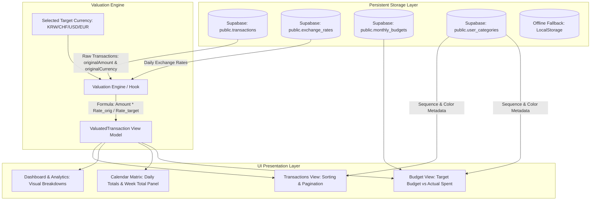

# Tallyon - Multi-Currency Expense Tracker

Tallyon is an intuitive, robust **multi-currency personal expense tracking and financial planning web application** designed for global citizens, international students, remote workers, and frequent travelers handling expenses in multiple currencies including Swiss Francs (**CHF**), US Dollars (**USD**), Euros (**EUR**), and South Korean Won (**KRW**).

Built on **React 19 + TypeScript (SPA)**, Tallyon seamlessly integrates with **Supabase (PostgreSQL + Row Level Security)** for persistent cloud storage and cross-device synchronization, while retaining an automatic **offline-first LocalStorage fallback mode**.

---

## 📑 Table of Contents
1. [Core Principles & Highlights](#-core-principles--highlights)
2. [Interface Overview & User Guide](#-interface-overview--user-guide)
3. [Supabase Technical Architecture & DDL Specification](#-supabase-technical-architecture--ddl-specification)
4. [Step-by-Step Supabase Setup Guide](#-step-by-step-supabase-setup-guide)
5. [Data Schema & Mappings (TypeScript vs Database)](#-data-schema--mappings-typescript-vs-database)
6. [Architecture & Valuation Flow](#-architecture--valuation-flow)
7. [LocalStorage Key Specifications (Offline Fallback)](#-localstorage-key-specifications-offline-fallback)
8. [Getting Started & Development](#-getting-started--development)

---

## 🌟 Core Principles & Highlights

### 1. Zero Distortion Principle (Lossless Currency Storage)
- Every transaction persistently records `originalAmount` and `originalCurrency`.
- Changing target currencies or updating daily exchange rates never alters or overwrites the recorded transactions.
- Valuation is performed dynamically by converting original amounts into the active view target currency through client-side valuation models (`ValuatedTransaction`).

### 2. Standardized 5-Field Interface
Transaction entry and modification modal dialogues adhere to a clean, unambiguous terminology:
- **`title`**: Expense description / narrative.
- **`amount`**: Numerical cost in original tender (positive float).
- **`currency`**: Original tender code (`CHF`, `USD`, `EUR`, `KRW`).
- **`category`**: Semantic classification.
- **`cycle`**: Expense nature (`One-off`, `Monthly`, `Yearly`) and recurring fixed expense toggle.

### 3. Pure English Canonical Categories & Custom Reordering
- 11 canonical categories mapped to purpose-crafted icons and harmonious color accents:
  - `Transport` (Transit / Bus icon)
  - `Living` (Lifestyle & Daily / Coffee icon)
  - `Food` (Dining & Groceries / Utensils icon)
  - `Subscriptions` (Recurring Services / Repeat icon)
  - `Administration` (Legal & Public Services / Landmark icon)
  - `Housing` (Rent & Home / Home icon)
  - `Health` (Medical & Fitness / HeartPulse icon)
  - `Education` (Tuition & Books / GraduationCap icon)
  - `Shopping` (Retail & Goods / ShoppingBag icon)
  - `Travel` (Flights & Lodging / Plane icon)
  - `Other` (Miscellaneous / Tag icon)
- Accessible via the **Budget** tab strip card banner, allowing users to reorder items (`▲`, `▼`), customize color schemes, and synchronize order across all views and filters.

---

## 🖥️ Interface Overview & User Guide

### 1. Global Navigation & Control Bar
- **Brand & Cloud Sync Status**: Shows `Cloud Sync` (green badge) when connected to Supabase or `Local` (gray badge) in offline mode.
- **Month Navigator**:
  - `◀`, `▶`: Step backward or forward month-by-month.
  - `This Month`: Instantly jump to the current calendar month.
  - `Month Picker Popover`: Click the active month pill to trigger a calendar matrix popup for fast multi-year navigation.
  - `ALL`: Switch to cumulative all-time overview mode to assess aggregate budgets and multi-month expenditures.
- **Target Currency Selector**:
  - Switch between `CHF`, `USD`, `EUR`, and `KRW` with a single click. All summary metrics, list amounts, and charts recalculate instantly.

### 2. Tab Views

#### ① Transactions
- **Real-Time Search & Multi-Filters**: Filter by text search, custom-ordered category chips, and expense cycles (`One-off`, `Monthly`, `Yearly`).
- **Sorting Popover (Triple Horizontal Bar Pill)**:
  - Alphabetical (`A → Z` / `Z → A`)
  - Chronological (`Newest first` / `Oldest first`)
  - Amount (`Highest first` / `Lowest first`)
- **Pagination Navigation**: Select `5`, `10`, `15`, or `20` records per page with intuitive page navigation.
- **Clean White Action Buttons**:
  - `Pencil icon`: Edit transaction details.
  - `Trash icon`: Delete transaction.
- **Direct Currency Display**: Displays converted amount in target currency alongside the raw original currency amount (e.g., `€15.00`, `₩15,000`) without redundant labels.

#### ② Dashboard & Analytics
- **Total Expenditure KPI**: Visualizes current/cumulative spending against active budgets with real-time percentage indicators.
- **Tri-Partite Expense Breakdown**:
  - `Fixed Expenses`: Regular monthly commitments (rent, transit pass, gym).
  - `Flexible Expenses`: Variable discretionary spending (dining, shopping, leisure).
  - `Yearly Commitments`: Annual expenses amortized to a monthly equivalent.
- **Category & Frequency Distributions**: Visual breakdown with interactive donut charts and progress meters.

#### ③ Budget
- **Target Monthly Budget**:
  - `Monthly Base Budget`: Recurring baseline monthly threshold.
  - `Extra Budget Adjustment (+/-)`: Temporary monthly adjustments.
- **Category Settings & Order Strip**:
  - Direct preview of current category sequence; click anywhere on the strip card to open the category manager modal.
- **Active Fixed Expenses Management**:
  - Prominent left-aligned **`TOTAL FIXED`** metric styled in 2.25rem bold blue, matching the Total Expenditure visual hierarchy.
  - Visual category color tape accents, round icons, and unified trash icon buttons to remove a commitment starting from the active month onward.

#### ④ Calendar Matrix View
- **Monthly Grid**: Daily expenditure totals and transaction count indicators.
- **Soft Weekend Tints**:
  - Sunday (`SUN`): Subtle soft-red tint (`rgba(254, 226, 226, 0.4)`) with rose headers.
  - Saturday (`SAT`): Subtle soft-blue tint (`rgba(219, 234, 254, 0.4)`) with royal blue headers.
- **Standalone `WEEK TOTAL` Side Panel**:
  - Distinctly separated via a dashed divider on the right to avoid confusing weekly aggregates with calendar days.
- **Daily Inspector Popup**: Click any cell to inspect itemized transactions with original and converted valuations.

#### ⑤ Floating Add Expense Modal
- Triggered by the persistent floating pencil button in the lower-right corner.
- Offers **Single Entry** and **Batch Entry** tabs for rapid expense input.
- **Fixed** and **Cycle** are independent. Only **Fixed + Monthly** auto-projects into future months; editing a later month's copy makes it the template for every month after it.

---

## 🏗️ Supabase Technical Architecture & DDL Specification

Tallyon communicates directly with Supabase via the client SDK (`@supabase/supabase-js`), secured with PostgreSQL **Row Level Security (RLS)**.

```
┌────────────────────────────────────────────────────────────────────────┐
│               GitHub Pages (React 19 + TypeScript SPA)                 │
│                                                                        │
│   [UI Layer: Calendar, Transactions, Dashboard, Budget, Modals]        │
│                                 │                                      │
│                                 ▼                                      │
│            [Valuation Engine & Presentation Aggregators]               │
│                                 │                                      │
│                                 ▼                                      │
│               [Supabase Repository Layer + Fallback]                   │
└─────────────────────────────────┬──────────────────────────────────────┘
                                  │ HTTPS / WSS (Supabase JS Client)
                                  ▼
┌────────────────────────────────────────────────────────────────────────┐
│                        Supabase Cloud Platform                         │
│                                                                        │
│   ├── Auth Service: Anonymous Sign-in / OAuth (JWT verification)       │
│   │                                                                    │
│   └── PostgreSQL Engine                                                │
│        ├── RLS Policies (auth.uid() = user_id enforcement)             │
│        ├── public.transactions (User's individual expense entries)     │
│        ├── public.monthly_budgets (User's monthly budget allocations)  │
│        ├── public.user_categories (Custom category order and styling)  │
│        └── public.exchange_rates (Daily exchange rates cache)          │
└────────────────────────────────────────────────────────────────────────┘
```

The complete database initialization script is provided in [`supabase_schema.sql`](file:///Users/mireflare/Documents/Codes/tallyon/supabase_schema.sql).

---

## 🛠️ Step-by-Step Supabase Setup Guide

Follow these steps in your Supabase project dashboard:

### Step 1: Create a Supabase Project
1. Log in to [supabase.com](https://supabase.com/) and click **New Project**.
2. Set a name (e.g. `tallyon`) and database password, then choose the region nearest to your users.

### Step 2: Enable Anonymous Authentication
Tallyon allows users to use the app immediately without requiring a password, while securely isolating data per device/browser session.
1. In your Supabase dashboard, navigate to **Authentication** $\to$ **Sign In / Up** $\to$ **User Signups**.
2. Toggle on **"Allow anonymous sign-ins"**.
3. Click **Save**.

### Step 3: Execute Database DDL & RLS Policies
1. In your Supabase dashboard, click **SQL Editor** from the left navigation menu.
2. Click **New Query**.
3. Copy and paste the contents of [`supabase_schema.sql`](file:///Users/mireflare/Documents/Codes/tallyon/supabase_schema.sql) into the query editor.
4. Click **Run** (`Cmd + Enter` or `Ctrl + Enter`).
5. Confirm that `transactions`, `monthly_budgets`, `user_categories`, and `exchange_rates` tables have been created with RLS enabled.

### Step 4: Retrieve API Keys & Configure Environment
1. In your Supabase dashboard, navigate to **Project Settings** (gear icon) $\to$ **API**.
2. Copy:
   - **Project URL** (under *Project URL*)
   - **anon public key** (under *Project API keys*)
3. Create a local `.env` file in the project root based on `.env.example`:
```bash
cp .env.example .env
```
4. Fill in your credentials:
```env
VITE_SUPABASE_URL=https://your-project-id.supabase.co
VITE_SUPABASE_ANON_KEY=your-anon-public-key
```
5. If deploying to **GitHub Pages**, navigate to **GitHub Repository Settings** $\to$ **Secrets and variables** $\to$ **Actions** and add `VITE_SUPABASE_URL` and `VITE_SUPABASE_ANON_KEY`.

---

## 💾 Data Schema & Mappings (TypeScript vs Database)

### 1. Database Table vs Domain Entity Mapping
The repository layer automatically maps between database `snake_case` rows and frontend domain `camelCase` entities:

| PostgreSQL Column (`snake_case`) | Domain Field (`camelCase`) | Type | Description |
| :--- | :--- | :--- | :--- |
| `id` | `id` | `UUID` / `string` | Unique record identifier |
| `user_id` | *(Handled by auth)* | `UUID` / `string` | Supabase authenticated user ID (`auth.uid()`) |
| `description` | `description` | `TEXT` / `string` | Title or narrative of transaction |
| `transaction_time` | `transactionTime` | `TIMESTAMPTZ` / `string` | ISO-8601 UTC timestamp |
| `original_amount` | `originalAmount` | `NUMERIC(14,2)` / `number` | Positive amount in original currency |
| `original_currency` | `originalCurrency` | `VARCHAR(3)` / `CurrencyCode` | Tender code (`CHF`, `USD`, `EUR`, `KRW`) |
| `category` | `category` | `TEXT` / `string` | Category identifier |
| `expense_nature` | `expenseNature` | `ENUM` / `ExpenseNature` | `'ONE_OFF'`, `'RECURRING_MONTHLY'`, `'RECURRING_YEARLY'` |
| `is_fixed` | `isFixed` | `BOOLEAN` / `boolean` | Fixed recurring commitment flag |
| `is_auto_generated` | `isAutoGenerated` | `BOOLEAN` / `boolean` | Projected entry from previous fixed expense |
| `parent_fixed_id` | `parentFixedId` | `UUID` / `string?` | Originating recurring transaction ID |
| `stopped_after_month`| `stoppedAfterMonth` | `VARCHAR(7)` / `string?` | `YYYY-MM` month after which recurring stops |
| `created_at` | `createdAt` | `TIMESTAMPTZ` / `string` | Timestamp of creation |
| `updated_at` | `updatedAt` | `TIMESTAMPTZ` / `string` | Timestamp of update |

---

## 🔄 Architecture & Valuation Flow



### Dynamic Valuation Formula
Exchange rates use South Korean Won (`KRW`) as the intermediate anchor currency (`baseCurrency: 'KRW'`):
$$\text{Amount}_{\text{KRW}} = \text{originalAmount} \times \text{rates}[\text{originalCurrency}]$$
$$\text{convertedAmount} = \frac{\text{Amount}_{\text{KRW}}}{\text{rates}[\text{targetCurrency}]}$$

- When `originalCurrency === targetCurrency`, no conversion rate is applied, preserving the exact numerical amount.
- Floating-point discrepancies are safeguarded via `safeAdd` and currency-specific formatting (`formatCurrency`).

---

## 🔑 LocalStorage Key Specifications (Offline Fallback)

If Supabase credentials are not provided or the network is unavailable, Tallyon seamlessly operates in local offline mode using browser LocalStorage:

| Key | Schema Description | Purpose |
| :--- | :--- | :--- |
| `@app/transactions` | `Transaction[]` | Raw, immutable record of all user expense entries |
| `@app/budgets` | `Record<string, MonthlyBudget>` | Keyed by `YYYY-MM` storing user budget allocations |
| `@app/custom_categories_v1` | `CategoryDefinition[]` | User-defined category sequencing and styling |
| `@app/exchange_rates` | `Record<string, ExchangeRateRecord>` | Keyed by `YYYY-MM-DD` historical exchange rates |

---

## 🚀 Getting Started & Development

### Prerequisites
- Node.js 18.0 or higher
- npm, yarn, or pnpm

### Installation & Local Run
```bash
# Clone repository
git clone <repository-url>
cd tallyon

# Install dependencies
npm install

# (Optional) Configure Supabase credentials
cp .env.example .env

# Start local development server
npm run dev
```

### Production Build & Linting
```bash
# TypeScript verification & Vite production bundling
npm run build

# Run code linter
npm run lint
```

---
**Tallyon** • Modern Multi-Currency Expense Tracker built with React 19, TypeScript, Supabase, and Repository Architecture.
