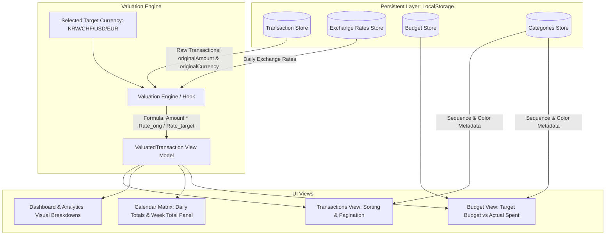

# Tallyon - Multi-Currency Expense Tracker

Tallyon is an intuitive, robust **multi-currency personal expense tracking and financial planning web application** designed for global citizens, international students, remote workers, and frequent travelers handling expenses in multiple currencies including Swiss Francs (**CHF**), US Dollars (**USD**), Euros (**EUR**), and South Korean Won (**KRW**).

To prevent **data corruption caused by exchange rate fluctuations or conversion rounding errors**, all transactions are perpetually recorded in their original currency and amount. Real-time dynamic valuation is computed strictly on the presentation layer, allowing seamless multi-currency aggregation without altering the raw underlying data.

---

## 📑 Table of Contents
1. [Core Principles & Highlights](#-core-principles--highlights)
2. [Interface Overview & User Guide](#-interface-overview--user-guide)
3. [Data Storage Schema (TypeScript Entities)](#-data-storage-schema-typescript-entities)
4. [Architecture & Valuation Flow](#-architecture--valuation-flow)
5. [LocalStorage Key Specifications](#-localstorage-key-specifications)
6. [Getting Started & Development](#-getting-started--development)

---

## 🌟 Core Principles & Highlights

### 1. Zero Distortion Principle (Lossless Currency Storage)
- Every transaction persistently records `originalAmount` and `originalCurrency`.
- Changing target currencies or updating daily exchange rates never alters or overwrites the recorded transactions.
- Valuation is performed dynamically by converting original amounts into the active view target currency through client-side valuation models (`ValuatedTransaction`).

### 2. Standardized 5-Field Interface
Transaction entry and modification modal dialogues adhere to a clean, unambiguous terminology:
- **`title`**: Expense description / narrative.
- **`amount`**: Numerical cost in original tender (positive float).
- **`currency`**: Original tender code (`CHF`, `USD`, `EUR`, `KRW`).
- **`category`**: Semantic classification.
- **`cycle`**: Expense nature (`One-off`, `Monthly`, `Yearly`) and recurring fixed expense toggle.

### 3. Pure English Canonical Categories & Custom Reordering
- Eliminates bilingual clutter by adopting pure English category names.
- 11 canonical categories mapped to purpose-crafted icons and harmonious color accents:
  - `Transport` (Transit / Bus icon)
  - `Living` (Lifestyle & Daily / Coffee icon)
  - `Food` (Dining & Groceries / Utensils icon)
  - `Subscriptions` (Recurring Services / Repeat icon)
  - `Administration` (Legal & Public Services / Landmark icon)
  - `Housing` (Rent & Home / Home icon)
  - `Health` (Medical & Fitness / HeartPulse icon)
  - `Education` (Tuition & Books / GraduationCap icon)
  - `Shopping` (Retail & Goods / ShoppingBag icon)
  - `Travel` (Flights & Lodging / Plane icon)
  - `Other` (Miscellaneous / Tag icon)
- Accessible via the **Budget** tab strip card banner, allowing users to reorder items (`▲`, `▼`), customize color schemes, and synchronize order across all views and filters.

---

## 🖥️ Interface Overview & User Guide

### 1. Global Navigation & Control Bar
- **Month Navigator**:
  - `◀`, `▶`: Step backward or forward month-by-month.
  - `This Month`: Instantly jump to the current calendar month.
  - `Month Picker Popover`: Click the active month pill to trigger a calendar matrix popup for fast multi-year navigation.
  - `ALL`: Switch to cumulative all-time overview mode to assess aggregate budgets and multi-month expenditures.
- **Target Currency Selector**:
  - Switch between `CHF`, `USD`, `EUR`, and `KRW` with a single click. All summary metrics, list amounts, and charts recalculate instantly.

### 2. Tab Views

#### ① Transactions
- **Real-Time Search & Multi-Filters**: Filter by text search, custom-ordered category chips, and expense cycles (`One-off`, `Monthly`, `Yearly`).
- **Sorting Popover (Triple Horizontal Bar Pill)**:
  - Alphabetical (`A → Z` / `Z → A`)
  - Chronological (`Newest first` / `Oldest first`)
  - Amount (`Highest first` / `Lowest first`)
- **Pagination Navigation**: Select `5`, `10`, `15`, or `20` records per page with intuitive page navigation.
- **Clean White Action Buttons**:
  - `Pencil icon`: Edit transaction details.
  - `Trash icon`: Delete transaction.
- **Direct Currency Display**: Displays converted amount in target currency alongside the raw original currency amount (e.g. `€15.00`, `₩15,000`) without redundant labels.

#### ② Dashboard & Analytics
- **Total Expenditure KPI**: Visualizes current/cumulative spending against active budgets with real-time percentage indicators.
- **Tri-Partite Expense Breakdown**:
  - `Fixed Expenses`: Regular monthly commitments (rent, transit pass, gym).
  - `Flexible Expenses`: Variable discretionary spending (dining, shopping, leisure).
  - `Yearly Commitments`: Annual expenses amortized to a monthly equivalent.
- **Category & Frequency Distributions**: Visual breakdown with interactive donut charts and progress meters.

#### ③ Budget
- **Target Monthly Budget**:
  - `Monthly Base Budget`: Recurring baseline monthly threshold.
  - `Extra Budget Adjustment (+/-)`: Temporary monthly adjustments.
- **Category Settings & Order Strip**:
  - Direct preview of current category sequence; click anywhere on the strip card to open the category manager modal.
- **Active Fixed Expenses Management**:
  - Prominent left-aligned **`TOTAL FIXED`** metric styled in 2.25rem bold blue, matching the Total Expenditure visual hierarchy.
  - Visual category color tape accents, round icons, and unified trash icon buttons to remove a commitment starting from the active month onward.

#### ④ Calendar Matrix View
- **Monthly Grid**: Daily expenditure totals and transaction count indicators.
- **Soft Weekend Tints**:
  - Sunday (`SUN`): Subtle soft-red tint (`rgba(254, 226, 226, 0.4)`) with rose headers.
  - Saturday (`SAT`): Subtle soft-blue tint (`rgba(219, 234, 254, 0.4)`) with royal blue headers.
- **Standalone `WEEK TOTAL` Side Panel**:
  - Distinctly separated via a dashed divider on the right to avoid confusing weekly aggregates with calendar days.
- **Daily Inspector Popup**: Click any cell to inspect itemized transactions with original and converted valuations.

#### ⑤ Floating Add Expense Modal
- Triggered by the persistent floating pencil button in the lower-right corner.
- Offers **Single Entry** and **Batch Entry** tabs for rapid expense input.
- Toggle **Recurring Fixed Expense** to automatically project the transaction into future months.

---

## 💾 Data Storage Schema (TypeScript Entities)

All models are strictly defined in TypeScript contracts:

### 1. `Transaction` Entity
```typescript
export interface Transaction {
  id: string;                     // UUIDv7 unique identifier (time-sortable)
  description: string;            // Item narrative (title)
  transactionTime: string;        // ISO-8601 UTC timestamp (e.g., "2026-09-07T18:30:00.000Z")
  originalAmount: number;         // Positive numerical cost
  originalCurrency: CurrencyCode; // Tender code ('CHF' | 'USD' | 'EUR' | 'KRW')
  category: string;               // Category name (e.g., 'Food', 'Transport')
  expenseNature: ExpenseNature;   // 'ONE_OFF' | 'RECURRING_MONTHLY' | 'RECURRING_YEARLY'
  isFixed?: boolean;              // True if item is a fixed commitment propagating into future months
  isAutoGenerated?: boolean;      // True if projected from an earlier fixed expense
  parentFixedId?: string;         // Originating transaction ID for recurring projections
  stoppedAfterMonth?: string;     // YYYY-MM boundary after which recurring projection ceases
  createdAt: string;              // ISO-8601 creation timestamp
  updatedAt: string;              // ISO-8601 update timestamp
}
```

### 2. `MonthlyBudget` Entity
```typescript
export interface MonthlyBudget {
  yearMonth: string;              // Target month in YYYY-MM format (e.g., "2026-09")
  baseBudget: number;             // Standard recurring monthly baseline
  extraBudget: number;            // Adjustment budget delta (+ / -)
  totalBudget: number;            // Computed budget = baseBudget + extraBudget
  currency: CurrencyCode;         // Base currency of budget declaration
  updatedAt: string;              // ISO-8601 update timestamp
}
```

### 3. `CategoryDefinition` Entity
```typescript
export interface CategoryDefinition {
  id: string;                     // Category key identifier (e.g., 'Transport')
  name: string;                   // Display name in English
  color: string;                  // Distinct hex color code (e.g., '#3B82F6')
  bgColor: string;                // Subtle background tint for pill badges (e.g., '#EFF6FF')
}
```

### 4. `ExchangeRateRecord` Entity
```typescript
export interface ExchangeRateRecord {
  date: string;                       // YYYY-MM-DD
  baseCurrency: 'KRW';                // Fixed reference anchor currency
  rates: Record<CurrencyCode, number>;// KRW value per 1 unit of foreign currency (e.g., { CHF: 1560.5, USD: 1385.0, EUR: 1502.0, KRW: 1.0 })
  updatedAt: string;
}
```

---

## 🔄 Architecture & Valuation Flow



### Dynamic Valuation Formula
Exchange rates use South Korean Won (`KRW`) as the intermediate anchor currency (`baseCurrency: 'KRW'`):
$$\text{Amount}_{\text{KRW}} = \text{originalAmount} \times \text{rates}[\text{originalCurrency}]$$
$$\text{convertedAmount} = \frac{\text{Amount}_{\text{KRW}}}{\text{rates}[\text{targetCurrency}]}$$

- When `originalCurrency === targetCurrency`, no conversion rate is applied, preserving the exact numerical amount.
- Floating-point discrepancies are safeguarded via `safeAdd` and currency-specific formatting (`formatCurrency`).

---

## 🔑 LocalStorage Key Specifications

| Key | Schema Description | Purpose |
| :--- | :--- | :--- |
| `@app/transactions` | `Transaction[]` | Raw, immutable record of all user expense entries |
| `@app/budgets` | `Record<string, MonthlyBudget>` | Keyed by `YYYY-MM` storing user budget allocations |
| `@app/custom_categories_v1` | `CategoryDefinition[]` | User-defined category sequencing and styling |
| `@app/exchange_rates` | `Record<string, ExchangeRateRecord>` | Keyed by `YYYY-MM-DD` historical exchange rates |

---

## 🚀 Getting Started & Development

### Prerequisites
- Node.js 18.0 or higher
- npm, yarn, or pnpm

### Installation & Local Run
```bash
# Clone repository
git clone <repository-url>
cd tallyon

# Install dependencies
npm install

# Start development server
npm run dev
```

### Production Build & Linting
```bash
# TypeScript verification & Vite production bundling
npm run build

# Run code linter
npm run lint
```

---
**Tallyon** • Modern Multi-Currency Expense Tracker built with React 19, TypeScript, and Repository Architecture.
