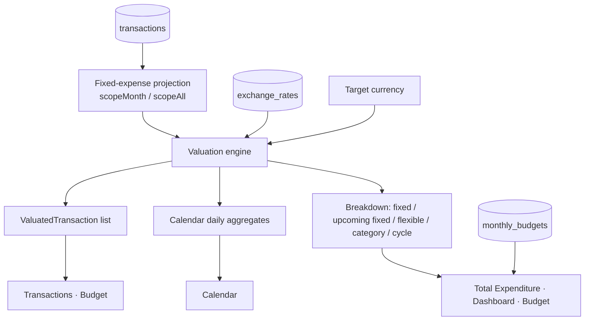

# Tallyon - Multi-Currency Expense Tracker

Tallyon is a **multi-currency personal expense tracker and monthly budget planner** for people who spend in several currencies at once: Swiss Francs (**CHF**), US Dollars (**USD**), Euros (**EUR**) and South Korean Won (**KRW**).

It is a **React 19 + TypeScript SPA** backed by **Supabase (PostgreSQL + Row Level Security)** for cloud sync, with an automatic **LocalStorage fallback** when Supabase is not configured or unreachable.

---

## Table of Contents

1. [Core Principles](#core-principles)
2. [Fixed Expenses & Cycles](#fixed-expenses--cycles)
3. [Interface Guide](#interface-guide)
4. [Supabase Architecture](#supabase-architecture)
5. [Supabase Setup](#supabase-setup)
6. [Data Schema](#data-schema)
7. [Valuation Flow](#valuation-flow)
8. [LocalStorage Keys](#localstorage-keys)
9. [Development](#development)

---

## Core Principles

### Lossless currency storage
- Every transaction stores its `originalAmount` and `originalCurrency`.
- Switching the view currency or refreshing exchange rates never rewrites stored data. Converted amounts are computed on the fly (`ValuatedTransaction`).

### One entry form, six fields
| Field | Meaning |
| :--- | :--- |
| `title` | Description of the expense |
| `amount` | Positive amount in the original currency |
| `currency` | `CHF`, `USD`, `EUR`, `KRW` |
| `category` | One of the user-ordered categories |
| `cycle` | `One-off`, `Monthly`, `Long-term` |
| `fixed` / `cash` | Independent toggles (see below) |

### Categories
11 built-in categories (`Transport`, `Living`, `Food`, `Subscriptions`, `Administration`, `Housing`, `Health`, `Education`, `Shopping`, `Travel`, `Other`), each with an icon and color. Order and colors are editable from the **Budget** tab and apply to every view.

---

## Fixed Expenses & Cycles

**Fixed** and **Cycle** are two independent properties. Any combination is allowed, and the badge shows both (e.g. `Fixed One-off`, `Fixed Monthly`, `Fixed Long-term`, `Monthly`).

| Fixed | Cycle | Counted as | Repeats into later months |
| :---: | :--- | :--- | :---: |
| ✅ | Monthly | Fixed | ✅ |
| ✅ | One-off / Long-term | Fixed | ❌ |
| ❌ | any | Flexible | ❌ |

### Auto-repeat (Fixed + Monthly only)
- A Fixed Monthly entry is projected into every following month, on the same day of month and at the same time. Days that don't exist (e.g. the 31st in February) move to the last day of that month.
- Projected copies are virtual (not stored) until you edit them.

### Editing a later month
- Editing a projected copy saves it as a real entry in that month, linked to the original (`parentFixedId`).
- **The most recently dated entry in the chain is the template for every month after it.** If the rent changes in April, May onward copies April's amount, date and time; earlier months keep the original.

### Stopping
- Deleting a Fixed Monthly entry from a later month stops the whole chain from that month onward. Past months are kept.
- Deleting a Fixed One-off / Long-term entry simply removes it.

### Upcoming (not yet executed) fixed expenses
Fixed entries dated after the current moment count as **upcoming**. They are included in all totals and drawn in **translucent red** in the expenditure bar, so you can see what is already committed but not yet paid.

---

## Interface Guide

### Control bar
- **Month navigator**: `◀` / `▶`, `This Month`, a month-picker popover, and `ALL` for the cumulative view.
- **Currency selector**: `CHF`, `USD`, `EUR`, `KRW`. All amounts and charts recalculate instantly.

### Total Expenditure card (all tabs)
- Total spending against the monthly budget, or against the cumulative budget in `ALL`.
- Stacked bar: **red** = executed fixed, **translucent red** = upcoming fixed, **green** = flexible.
- In `ALL`, Fixed Monthly copies are included for every month from the first entry through the current month.

### Dashboard / Analytics
- Fixed vs. flexible breakdown.
- Cycle breakdown: Long-term Commitments, Monthly, One-off.
- Category donut chart with legend.

### Calendar
- Monthly grid with weekend tints (Sunday soft red, Saturday soft blue) and a separate `WEEK TOTAL` column.
- Each day shows (right-aligned):
  - **Flexible spending** for that day in gray text.
  - The **daily total** in a matte-glass pill.
- A three-dot slider above the grid switches what each day shows:
  1. Daily total + flexible spending (default)
  2. Daily total only
  3. Flexible spending only (the week column then sums flexible spending)
- **Overspending days**: the flexible amount turns **bold red** when it exceeds

  $$\frac{2 \times \text{monthly flexible budget}}{\text{days in month}}$$

  where *flexible budget = monthly budget − fixed expenses*.
- Click a day to see its transactions with original and converted amounts.

### Transactions
- Text search, category chips and cycle filters.
- Sort by title, date or amount; 5 / 10 / 15 / 20 rows per page.
- Edit (pencil) and delete (trash) per row.

### Budget
- **Monthly budget** = base budget + extra adjustment (+/−). Fixed budget is auto-calculated from fixed expenses; flexible budget is the rest.
- **Active Fixed Expenses** for the month, in two sections:
  - **Fixed Monthly**: repeating.
  - **Fixed Long-term / One-off**: non-repeating, collapsible.
- In `ALL`, shows cumulative budget vs. cumulative spending from a configurable start month.

### Add Expense
- The floating pencil button (bottom right) opens **Single** and **Batch** entry. Fixed, Cycle and Cash can be set per row.

---

## Supabase Architecture

```
┌────────────────────────────────────────────────────────────────────────┐
│               GitHub Pages (React 19 + TypeScript SPA)                 │
│   [UI: Calendar, Transactions, Dashboard, Budget, Modals]              │
│                                 │                                      │
│   [Fixed-expense projection → Valuation engine → Aggregates]           │
│                                 │                                      │
│   [Supabase repositories + LocalStorage fallback]                      │
└─────────────────────────────────┬──────────────────────────────────────┘
                                  │ HTTPS (supabase-js)
┌─────────────────────────────────▼──────────────────────────────────────┐
│ Supabase                                                               │
│   Auth: anonymous sign-in, Google OAuth                                │
│   PostgreSQL + RLS (auth.uid() = user_id)                              │
│     public.transactions · public.monthly_budgets                       │
│     public.user_categories · public.exchange_rates                     │
└────────────────────────────────────────────────────────────────────────┘
```

The full DDL is in [`supabase_schema.sql`](supabase_schema.sql).

---

## Supabase Setup

1. **Create a project** at [supabase.com](https://supabase.com/).
2. **Enable anonymous sign-in**: Authentication → Sign In / Up → *Allow anonymous sign-ins*.
3. **(Optional) Enable Google sign-in**: Authentication → Providers → Google.
4. **Configure redirect URLs**: Authentication → URL Configuration.
   - **Site URL**: your production URL (e.g. `https://<user>.github.io/tallyon/`).
   - **Redirect URLs**: add every origin you sign in from, e.g. `http://localhost:5173/**` and `https://<user>.github.io/tallyon/**`.
   - If a URL is missing here, Supabase falls back to the Site URL. That's why a local login can land on GitHub Pages.
5. **Create tables & policies**: SQL Editor → paste [`supabase_schema.sql`](supabase_schema.sql) → Run.
6. **Configure the environment**: copy the Project URL and anon key from Project Settings → API.
   ```bash
   cp .env.example .env
   ```
   ```env
   VITE_SUPABASE_URL=https://your-project-id.supabase.co
   VITE_SUPABASE_ANON_KEY=your-anon-public-key
   ```
   For GitHub Pages, add the same two values as repository secrets (Settings → Secrets and variables → Actions).

---

## Data Schema

| PostgreSQL column | Domain field | Type | Description |
| :--- | :--- | :--- | :--- |
| `id` | `id` | `UUID` | Record ID |
| `user_id` | *(auth)* | `UUID` | `auth.uid()` |
| `description` | `description` | `TEXT` | Title |
| `transaction_time` | `transactionTime` | `TIMESTAMPTZ` | ISO-8601 UTC |
| `original_amount` | `originalAmount` | `NUMERIC(14,2)` | Positive amount |
| `original_currency` | `originalCurrency` | `VARCHAR(3)` | `CHF`, `USD`, `EUR`, `KRW` |
| `category` | `category` | `TEXT` | Category name |
| `expense_nature` | `expenseNature` | `ENUM` | Cycle: `ONE_OFF` (One-off), `RECURRING_MONTHLY` (Monthly), `RECURRING_YEARLY` (Long-term) |
| `is_fixed` | `isFixed` | `BOOLEAN` | Fixed flag, independent of cycle |
| `is_cash` | `isCash` | `BOOLEAN` | Paid in cash |
| `is_auto_generated` | `isAutoGenerated` | `BOOLEAN` | Projected copy (virtual) |
| `parent_fixed_id` | `parentFixedId` | `UUID?` | Root of the Fixed Monthly chain |
| `stopped_after_month` | `stoppedAfterMonth` | `VARCHAR(7)?` | `YYYY-MM` from which the chain stops |
| `created_at` / `updated_at` | `createdAt` / `updatedAt` | `TIMESTAMPTZ` | Timestamps |

---

## Valuation Flow



KRW is the anchor currency:

$$\text{Amount}_{\text{KRW}} = \text{originalAmount} \times \text{rates}[\text{originalCurrency}]$$
$$\text{convertedAmount} = \frac{\text{Amount}_{\text{KRW}}}{\text{rates}[\text{targetCurrency}]}$$

When the original and target currency match, the amount is used as-is.

---

## LocalStorage Keys

| Key | Content |
| :--- | :--- |
| `@app/transactions` | `Transaction[]` |
| `@app/budgets` | `Record<YYYY-MM, MonthlyBudget>` |
| `@app/custom_categories_v1` | `CategoryDefinition[]` |
| `@app/exchange_rates` | `Record<YYYY-MM-DD, ExchangeRateRecord>` |

---

## Development

Requires Node.js 18+ (the self-check below needs Node 22.6+ for native TypeScript).

```bash
npm install
cp .env.example .env    # optional: Supabase credentials
npm run dev             # http://localhost:5173
```

```bash
npm run build                              # type-check + production build
npm run lint                               # oxlint
node src/utils/fixedExpenses.check.ts      # fixed-expense projection self-check
```

### Deployment
Every push to `main` runs [`.github/workflows/deploy.yml`](.github/workflows/deploy.yml), which builds with the Supabase secrets and publishes `dist/` to GitHub Pages.
